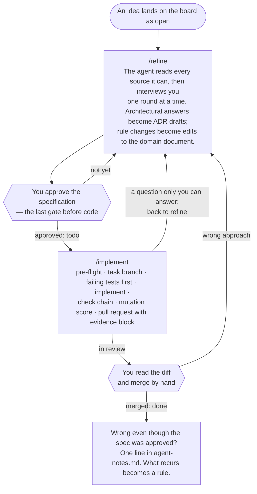
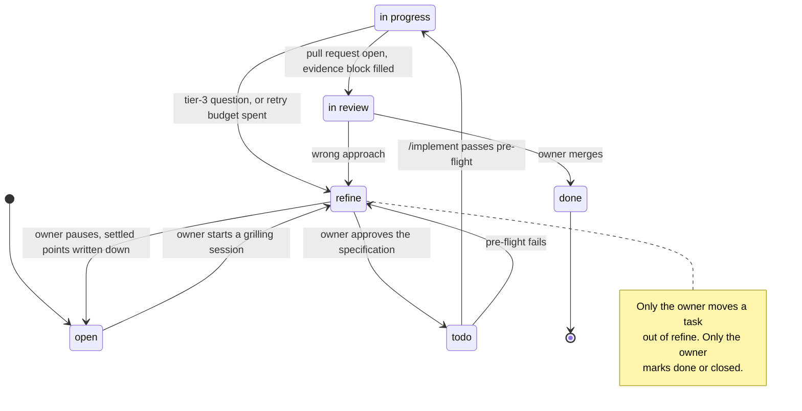

# Quarterdeck

A workflow for building software with coding agents where **you** stay in command of the design,
the architecture and what gets merged — and the agent does the implementation.

It is language-agnostic and project-agnostic: a set of documents, two agent skills, one hook and
three checks — and a third skill that installs them into any existing git repository by reading
the project, interviewing you, and then proving the installation with a deterministic `doctor`.
It works with any source of truth your project already has — a PRD, a design document, an API
contract, a spec — and with ClickUp, GitHub Issues, Markdown files or any tracker your agent can
reach.

## What it is for

Handing implementation to an agent fails in five recurring ways. Most of what goes wrong is one
of them:

| | The problem | What it looks like |
|---|---|---|
| 1 | **Building on undecided ground** | The task rests on a question nobody has answered — or the design documents carry two competing answers — and the agent picks one silently. You find out weeks later. |
| 2 | **Losing the thread** | After a month nobody knows how the project works, what was decided, or why. The design lives in old chat sessions. |
| 3 | **Invented work** | A settings module with fake settings, a helper nothing calls, an abstraction for a second case that does not exist — code that exists so that there is something to test or show. |
| 4 | **Tests that prove nothing** | Tests that assert nothing, or assert whatever the implementation happened to do. Coverage is green; the code is wrong. |
| 5 | **Silent improvisation when blocked** | The agent is stuck on a dependency that is not done or a question it cannot answer, and instead of stopping it works around it. Nobody is told. |

Spec-first frameworks answer the first problem and stop there. Their rules are prose, graded by
the same model that wrote the code. Quarterdeck's one principle is:

> **Any rule that must hold is executable, or it does not hold.**

Every guardrail is put on the cheapest surface that can actually enforce it — a hook that refuses
the command, a check that fails the build, a CI gate that fails the pull request. The few rules
that cannot be made executable are named as such and placed where they will be read.

| Problem | What answers it |
|---|---|
| 1 · Undecided ground | A **definition of ready** an agent must refuse to violate; `refine` as a real board status; a specification in which **every line cites its source** — an uncited line is an invention, visible without checking anything |
| 2 · Losing the thread | The specification is approved **before** code exists; architectural choices become ADRs; every pull request logs the decisions it made and the alternatives it rejected |
| 3 · Invented work | A check that fails when a module is imported **only by tests** — the shape invented work takes and dead-code tools miss; an explicit *Out of scope* field on every task |
| 4 · Tests that prove nothing | The **first commit on a branch is failing tests only**, checked in CI; mutation score instead of coverage; assertions against the number in the document, never the number the code returned |
| 5 · Silent improvisation | Three tiers of decision — the third is **stop**; a retry budget of three identical failures; a hook that makes merging physically the owner's |

## The process



Two hands touch a task. The agent does the reading, the asking, the writing and the proving.
You make the decisions only you can make, approve the specification, and merge. An agent never
merges, never marks a task done and never closes one.

### The task lifecycle

Seven statuses on your board, whatever your board calls them:



### What the agent may decide on its own

| Tier | Examples | Behaviour |
|---|---|---|
| 1 — decide silently | Naming, file layout, private helpers, test arrangement | Just do it |
| 2 — decide and log | A real choice with a defensible answer that changes neither architecture nor a product rule | Proceed; record the choice **and the rejected alternative** in the pull request |
| 3 — stop | Changes a rule or number in the domain document; adds a dependency; crosses a layer boundary; alters a public type other layers use; contradicts a source | Task back to `refine` with a comment. No pull request |

### Where each rule is enforced

| Rule | Surface |
|---|---|
| No commit, push, merge, rebase or force-push on the main branch; no merging a pull request | **Hook** — refuses the tool call before it runs |
| A module imported only by tests | **Check command** — `test-only-modules` |
| First commit on a branch is failing tests only | **CI** — `check-tests-first` |
| Every section of the evidence block present | **CI** — `check-pr-evidence` |
| Dead files, unused dependencies, layer boundaries, tests that miss wrong answers | **Check command** — your language's tools ([table below](#tools-by-language)) |
| Source precedence, the three tiers, the retry budget, never weakening a test | **Agent instructions** — judgement, named honestly as prose |

## What it installs

| Piece | Path in your project | What it does |
|---|---|---|
| The doctrine | `docs/workflow/workflow.md` | How a task travels from idea to merged commit: statuses, who may move what, the definition of ready, the three tiers, the retry budget, the evidence block |
| The task template | `docs/workflow/task-template.md` | The shape a task must have before an agent may touch it, with a worked example |
| The board procedures | `docs/workflow/board.md` | How an agent reads, moves, comments on and creates a task on *your* board — rendered for ClickUp, GitHub Issues, Markdown files, or any tracker reachable from the session |
| The agent notes | `docs/workflow/agent-notes.md` | A log of rule gaps found by rejected work. Read by a person at milestone boundaries |
| ADR seed | `docs/adr/` | A README and a template, if the folder was empty |
| `/refine` | `.claude/skills/refine/` | Turns a conversation into a specification and writes it to the board on your word |
| `/implement` | `.claude/skills/implement/` | Pre-flight, branch, tests first, implement, verify, architecture verdict, pull request with evidence |
| The hook | `.claude/hooks/guard-main.py` | Refuses `git push` to the main branch, merges, rebases, force-pushes and `gh pr merge` |
| Tests-first check | `tools/quarterdeck/check-tests-first.py` | Fails a pull request whose first commit touches anything but test files |
| Evidence check | `tools/quarterdeck/check-pr-evidence.py` | Fails a pull request whose body lacks a section of the evidence block |
| Test-only-module check | `tools/quarterdeck/test-only-modules.py` | Fails when a module is imported only by tests. TypeScript/JavaScript and Python |
| Agent instructions | a block in `CLAUDE.md` / `AGENTS.md` | The rules no tool can enforce, the sources-of-truth table, the check command, the board |
| Pull request template | `.github/pull_request_template.md` | The evidence block, empty |
| CI | `.github/workflows/quarterdeck.yml` | The two pull-request checks, if you say yes |
| The manifest | `.quarterdeck.json` | The one binding between the doctrine and your project: branches, commands, test globs, board, sources of truth. The hook, the checks and the skills read it at runtime |

The doctrine, the skills, the hook and the checks are **identical in every project** — nothing in
them is rendered — so `doctor` can diff them against the version you have and tell an outdated
install from a local edit. Only two files are project-specific prose: the board procedures and
the instruction block, both written by the setup skill and fact-checked by `doctor`.

## Installing it into a project

Quarterdeck is distributed as an [agent skill](https://skills.sh). From the project root:

```bash
npx skills add panovek/quarterdeck
```

The CLI finds `quarterdeck-setup`, asks which agents to install it for, and copies it — with
everything it installs — into the project (`.claude/skills/quarterdeck-setup/` for Claude Code).
Add `-g` to install it once for every project instead:

```bash
npx skills add panovek/quarterdeck --skill quarterdeck-setup -a claude-code -g -y
```

It also writes `skills-lock.json` next to your other lockfiles; commit it if you want the team
pinned to the same version. Then, in the project's agent session:

```
/quarterdeck-setup
```

The skill reads the repository first — ecosystem, main branch, the test and check commands (which
it runs before believing them), test globs (which it checks against real files), ADR folder,
candidate domain documents, board, CI system — and only then asks you the questions no detector can
answer, in one round, each with the detected default and the evidence for it:

- which branch is the owner's, and how task branches are named;
- **which document owns which domain** — architecture, the scope of the current change, the
  product rules — and, honestly, whether anything owns product rules yet;
- which board holds the tasks, what its statuses are called, and the lists an agent may create in;
- the check command, the test command, the mutation command if there is one;
- where the source lives and which files are tests.

Every step of the install has a validation the skill must pass before moving on; the last step is
`doctor`, which must report zero failures. Nothing is committed — you review the working tree.

Then, by hand — the skill prints this list with your project's names in it:

1. Put the one-line digest of your accepted ADRs directly under the block in `CLAUDE.md`. If you
   have no ADRs, the first one names your layers and the import rule between them; the skill will
   draft it if you ask.
2. Configure the board: the seven statuses and the agent-writable lists.
3. Add the test-only-module check, your dead-code tool and your boundary lint to the check command;
   add mutation testing on the pure part of the code.
4. Validate every gate that reports a number: plant one mutant, one test-only module, one boundary
   violation, and watch each fail.
5. Put one small task through `open → refine → todo → in progress → in review → done`. Nothing is
   installed until that has happened once.

The hook and the checks are Python 3.9+, standard library only — present on macOS, on every
common Linux image and on every CI runner. That is the only runtime requirement in the project.

### `doctor`

```bash
python3 .claude/skills/quarterdeck-setup/assets/tools/doctor.py
```

(or `~/.claude/skills/…` for a global install; or just ask the agent to *verify Quarterdeck*.)

The executable half of the installer: the skill decides and writes, `doctor` verifies. It checks
the manifest has every field the tools read; that every shipped file is byte-identical to the
version you have; that the seeds exist; that the board file and the instruction block state the
facts the manifest holds; that the hook is wired — and then **fires the hook at commands it must
refuse and at commands it must allow**, each with a known answer. It ends with which of the five
problems are answered mechanically in this project and which only by prose.

### Upgrading

```bash
npx skills update quarterdeck-setup
```

then `/quarterdeck-setup` again. The skill sees the version change, overwrites the shipped files
that changed upstream — stopping on any that carry a local edit, so that the edit can go upstream
instead of being lost — re-renders the two prose files if their templates changed and shows you
the diff, and finishes with `doctor`. Seeds are never touched.

## Sources of truth

Authority is per domain, not one ranking. Each domain has exactly one owner, and the table is
part of the agent's instructions:

| Domain | Owner |
|---|---|
| Architecture, layer boundaries, structural rules | The ADR folder |
| Scope of the change being made right now | The task on the board |
| The plan: milestones, ordering, dependencies, what is next | The board — lists are milestones, blocking links are dependencies, statuses are the state. There is no plan file |
| Product rules, formulas, constants, lexicon | The domain document — your PRD, design document, spec or API contract |
| What currently exists | The code — evidence of what *is*, never authority for what *should be* |

A project that has no domain document yet says so in the table. That is allowed, and recorded,
so that everyone knows problems 1 and 2 are only half-answered until one exists. Code that
contradicts the domain document is a bug report, not a source conflict. Two sources that disagree
are a thing to report, naming both sides — never to resolve by choosing.

## Tools by language

Quarterdeck ships the language-free checks. Three more gates are the project's to configure, and
the check command should chain them:

| Language | Mutation testing | Dead code, unused dependencies | Layer boundaries |
|---|---|---|---|
| TypeScript / JavaScript | Stryker | knip | eslint-plugin-boundaries, dependency-cruiser |
| Python | mutmut, Cosmic Ray | vulture, deptry | import-linter |
| Elixir | muzak, mutix | mix_unused, `mix compile --warnings-as-errors`, `mix deps.unlock --check-unused` | boundary |
| Go | gremlins, go-mutesting | deadcode, `go mod tidy -diff` | go-arch-lint |
| Rust | cargo-mutants | cargo-machete, compiler warnings as errors | a `tests/` ArchUnit-style check, or module visibility |
| Java / Kotlin | PIT | `mvn dependency:analyze` | ArchUnit, Konsist |
| C# | Stryker.NET | Roslyn analyzers (IDE0051 etc.) | NetArchTest |
| PHP | Infection | composer-unused | deptrac |
| Ruby | mutant | debride | packwerk |
| Swift | muter | periphery | a SwiftLint custom rule |
| Any of Go, TS, Python, Java | — | — | lintel (`arch.yaml`, tree-sitter) |

Scope mutation testing to the part of the code that is pure and deterministic — a full run should
take seconds, or it will be turned off. Record the scope in an ADR, set the threshold to what it
measures on day one, and let it ratchet upward only.

The test-only-module check understands TypeScript, JavaScript and Python. For another language,
write the equivalent — the rule is one sentence: *a source file whose every importer is a test
file fails the build* — and put it in the check command. In Elixir, `mix xref graph --format dot`
gives you the import graph to apply it to.

## What it does not do

- It does not run agents, orchestrate them, or run more than one. One task at a time; one human
  reads one diff.
- It does not write specifications for you. `/refine` asks; you decide.
- It does not install language tools. It tells you which ones and where they go.
- It does not configure the board. Statuses and lists are yours to create; the skills only move
  tasks between them.
- It does not replace your check command. It adds three checks to it and a hook in front of it.

## Origin

Extracted from a product whose core logic is written by agents against a design document, and
generalised. The rule gaps found there flow back into this repository as changes to the doctrine;
projects that adopt it pick them up on the next upgrade. The name is the deck of a ship from which it is
commanded: the one who stands there decides the course, and does not row.

## For maintainers: releasing

The skill is whatever is on the default branch of this repository — `npx skills add` fetches it
from GitHub, and [skills.sh](https://skills.sh) lists a skill automatically from anonymous install
telemetry; there is no registry to publish to. A release is therefore:

1. Bump `skills/quarterdeck-setup/assets/VERSION`. `doctor` compares it with the `quarterdeck`
   field of every installed manifest, and the skill's upgrade mode keys off it.
2. Push to the default branch; tag it as well so that a project can name the version it took.
3. Check with `npx skills add panovek/quarterdeck --list` that the skill is discovered.

Only `skills/quarterdeck-setup/` is installed; the README and licence stay here.

## Licence

MIT.
